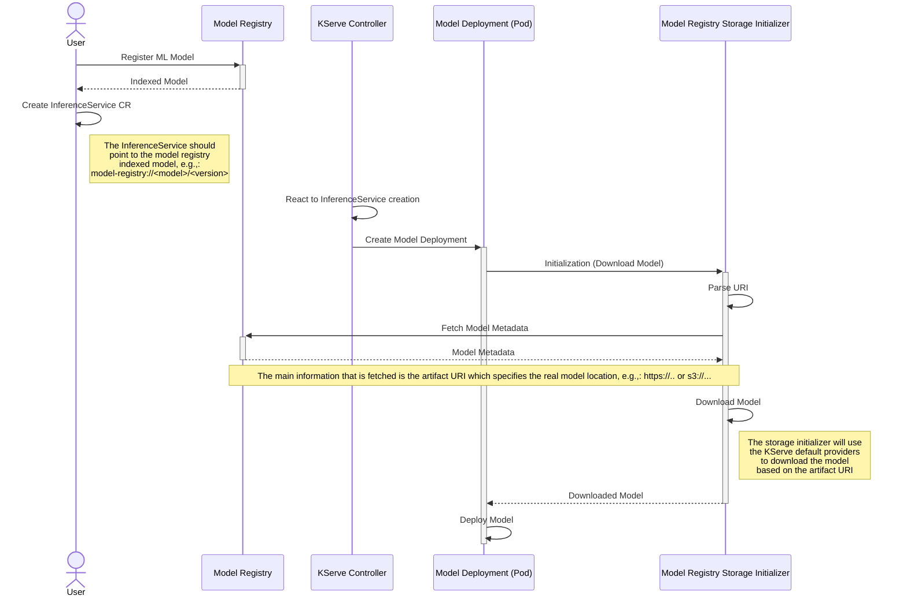

# Model Registry Custom Storage Initializer

Welcome :wave:! 

Here, you'll find an example implementation of a Kserve custom storage initializer tailored for the `model-registry://` URI format. This functionality aligns seamlessly with the specifications outlined in the [ClusterStorageContainer](https://kserve.github.io/website/latest/modelserving/storage/storagecontainers/) CRD.

This implementation is intended to work with any model registry service that exposes a REST interface compatible with the [Opendatahub OpenAPI spec](https://github.com/opendatahub-io/model-registry/blob/v0.1.1/api/openapi/model-registry.yaml). Explore the possibilities and enhance your model-serving experience with this powerful integration with a generic Model Registry.

## Development

Build container image:
```bash
make docker-build
```

By default the container image name is `quay.io/${USER}/model-registry-storage-initializer:latest` but it can be overridden providing the `IMG` env variable, e.g., `make IMG=quay.io/ORG/NAME:TAG docker-build`.

Push the generated image:
```bash
make [IMG=..] docker-push
```

## Workflow

The following diagram showcase the interactions among all participants/actors involved in the model deployment process using the proposed `Model Registry Storage Initializer`.

<!-- 
  Issue rendering on github while using create/destroy keywords, might be because Github
  is using older Mermaid version. Ref https://github.com/mermaid-js/mermaid/issues/4388

  create participant MD as Model Deployment (Pod)

  create participant MRSI as Model Registry Storage Initializer
  destroy MRSI
-->



The same diagram is also available as exported [image](./docs/flow_diagram.png).

## Quickstart

Embark on your journey with this custom storage initializer by exploring a simple hello-world example. Learn how to seamlessly integrate and leverage the power of our tool in just a few steps.

This quickstart is heavily inspired by the [Getting Started with Kserve](https://kserve.github.io/website/master/get_started/).

### Prerequisites

* Install [Kind](https://kind.sigs.k8s.io/docs/user/quick-start) (Kubernetes in Docker)¶ to run local Kubernetes cluster with Docker container nodes.
* Install the [Kubernetes CLI (kubectl)](https://kubernetes.io/docs/tasks/tools/), which allows you to run commands against Kubernetes clusters. 

### Environment Preparation

#### Create the environment

1. After having kind installed, create a kind cluster with:
```bash
kind create cluster
```

2. Configure `kubectl` to use kind context
```bash
kubectl config use-context kind-kind
```

3. Setup local deployment of *Kserve* using the provided *Kserve quick installation* script
```bash
curl -s "https://raw.githubusercontent.com/kserve/kserve/release-0.11/hack/quick_install.sh" | bash
```

4. Install *model registry* in the local cluster

```bash
curl -s "https://raw.githubusercontent.com/lampajr/model-registry-storage-initializer/release-v0.0.x/hack/install_model_registry.sh" | bash
```

### First InferenceService

In this tutorial, you will deploy an InferenceService with a predictor that will load a model indexed into the model registry, the indexed model refers to a scikit-learn model trained with the [iris](https://archive.ics.uci.edu/ml/datasets/iris) dataset. This dataset has three output class: Iris Setosa, Iris Versicolour, and Iris Virginica.

You will then send an inference request to your deployed model in order to get a prediction for the class of iris plant your request corresponds to.

Since your model is being deployed as an InferenceService, not a raw Kubernetes Service, you just need to provide the storage location of the model using the `model-registry://` URI format and it gets some super powers out of the box.

#### Index the `Model` into the registry

Apply `Port Forward` to the model registry service in order to being able to interact with it from the outside of the cluster.
```bash
MODEL_REGISTRY_SERVICE=$(kubectl get svc -n model-registry --selector="component=model-registry" --output jsonpath='{.items[0].metadata.name}')
kubectl port-forward --namespace model-registry svc/${MODEL_REGISTRY_SERVICE} 8080:8080
```
And then:
```bash
export MR_HOSTNAME=localhost:8080
```

1. Register an empty `RegisteredModel`

```bash
curl --silent -X 'POST' \
  "$MR_HOSTNAME/api/model_registry/v1alpha1/registered_models" \
  -H 'accept: application/json' \
  -H 'Content-Type: application/json' \
  -d '{
  "description": "Iris scikit-learn model",
  "name": "iris"
}'
```

2. Register the first `ModelVersion`

```bash
curl --silent -X 'POST' \
  "$MR_HOSTNAME/api/model_registry/v1alpha1/model_versions" \
  -H 'accept: application/json' \
  -H 'Content-Type: application/json' \
  -d '{
  "description": "Iris model version v1",
  "name": "v1",
  "registeredModelID": "1"
}'
```

3. Register the raw `ModelArtifact`

This artifact defines where the actual trained model is stored, i.e., `gs://kfserving-examples/models/sklearn/1.0/model`

```bash
curl --silent -X 'POST' \
  "$MR_HOSTNAME/api/model_registry/v1alpha1/model_versions/2/artifacts" \
  -H 'accept: application/json' \
  -H 'Content-Type: application/json' \
  -d '{
  "description": "Model artifact for Iris v1",
  "uri": "gs://kfserving-examples/models/sklearn/1.0/model",
  "state": "UNKNOWN",
  "name": "iris-model-v1",
  "modelFormatName": "sklearn",
  "modelFormatVersion": "1",
  "artifactType": "model-artifact"
}'
```

> *NOTE*: double check the provided IDs are the expected ones.

#### Apply the `ClusterStorageContainer` resource

Retrieve the model registry service and MLMD port:
```bash
MODEL_REGISTRY_SERVICE=$(kubectl get svc -n model-registry --selector="component=model-registry" --output jsonpath='{.items[0].metadata.name}')
MODEL_REGISTRY_REST_PORT=$(kubectl get svc -n model-registry --selector="component=model-registry" --output jsonpath='{.items[0].spec.ports[1].targetPort}')
```

Apply the cluster-scoped `ClusterStorageContainer` CR to setup configure the `model registry storage initilizer` for `model-registry://` URI formats.

```bash
kubectl apply -f - <<EOF
apiVersion: "serving.kserve.io/v1alpha1"
kind: ClusterStorageContainer
metadata:
  name: mr-initializer
spec:
  container:
    name: storage-initializer
    image: quay.io/alampare/model-registry-storage-initializer:latest
    env:
    - name: MODEL_REGISTRY_BASE_URL
      value: "$MODEL_REGISTRY_SERVICE.model-registry.svc.cluster.local:$MODEL_REGISTRY_REST_PORT"
    - name: MODEL_REGISTRY_SCHEME
      value: "http"
    resources:
      requests:
        memory: 100Mi
        cpu: 100m
      limits:
        memory: 1Gi
        cpu: "1"
  supportedUriFormats:
    - prefix: model-registry://

EOF
```

#### Create an `InferenceService`

1. Create a namespace
```bash
kubectl create namespace kserve-test
```

2. Create the `InferenceService`
```bash
kubectl apply -n kserve-test -f - <<EOF
apiVersion: "serving.kserve.io/v1beta1"
kind: "InferenceService"
metadata:
  name: "iris-model"
spec:
  predictor:
    model:
      modelFormat:
        name: sklearn
      storageUri: "model-registry://iris/v1"
EOF
```

3. Check `InferenceService` status
```bash
kubectl get inferenceservices iris-model -n kserve-test
```

4. Determine the ingress IP and ports

```bash
kubectl get svc istio-ingressgateway -n istio-system
```

And then:
```bash
INGRESS_GATEWAY_SERVICE=$(kubectl get svc --namespace istio-system --selector="app=istio-ingressgateway" --output jsonpath='{.items[0].metadata.name}')
kubectl port-forward --namespace istio-system svc/${INGRESS_GATEWAY_SERVICE} 8081:80
```

After that (in another terminal):
```bash
export INGRESS_HOST=localhost
export INGRESS_PORT=8081
```

5. Perform the inference request

Prepare the input data:
```bash
cat <<EOF > "./iris-input.json"
{
  "instances": [
    [6.8,  2.8,  4.8,  1.4],
    [6.0,  3.4,  4.5,  1.6]
  ]
}
EOF
```

If you do not have DNS, you can still curl with the ingress gateway external IP using the HOST Header.
```bash
SERVICE_HOSTNAME=$(kubectl get inferenceservice iris-model -n kserve-test -o jsonpath='{.status.url}' | cut -d "/" -f 3)
curl -v -H "Host: ${SERVICE_HOSTNAME}" -H "Content-Type: application/json" "http://${INGRESS_HOST}:${INGRESS_PORT}/v1/models/iris-v1:predict" -d @./iris-input.json
```
